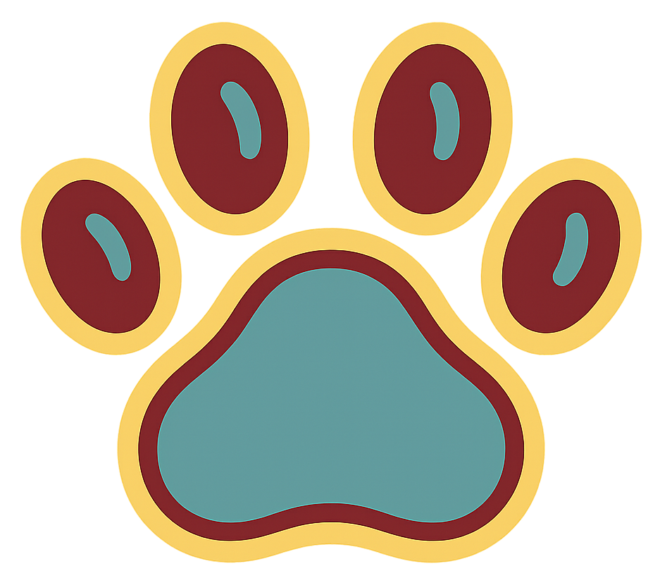
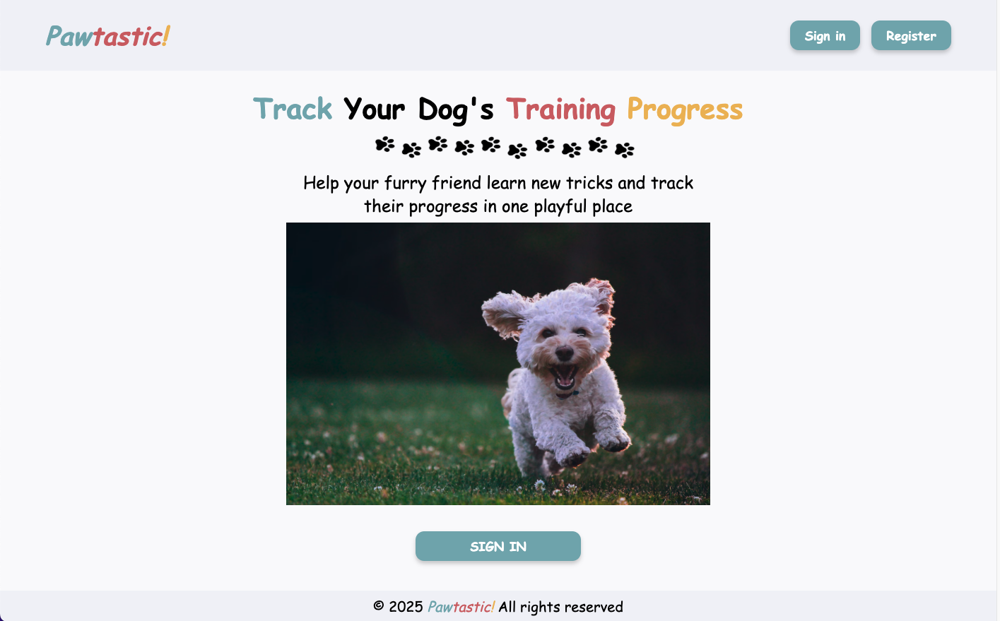

<h1 style="font-style: italic">
  <span style="color: #7EACB5;">Paw</span><span style="color: #C96868;">tastic</span><span style="color: #e9ba4c;">!</span>
  
</h1> 

Pawtastic is a Ruby on Rails web application designed to help dog owners keep track of their dogs tricks progress. 

_Please note: This project is in it's infancy and in development_



## Requirements

Before getting started, please make sure you have the following installed:

- **Ruby** (version 3.4.3)
- **Rails** (version 8.0.2)
- **PostgreSQL** (or SQLite3 for local development)

To check existing dependencies i.e. ruby 3.4.3:

```
ruby -v
rails -v
psql --version
```


## Setup

###Clone the repository:

```
git clone https://github.com/Melanie-Clark/pawtastic.git
cd pawtastic
```

### Install the required dependencies:
`bundle install`

### Set up environment variables:

Create a new file under the project root:

`echo "DB_USERNAME=[Enter db username] 
DB_PASSWORD=[Enter db password]" >> .env`

### Database Setup
Create the database:

`rails db:create`

Run database migrations:

`rails db:migrate`

### Running the Server
Start the Rails server:

`rails s`

### Open the app in your browser:

Navigate to http://localhost:3000 to view the app in action!
